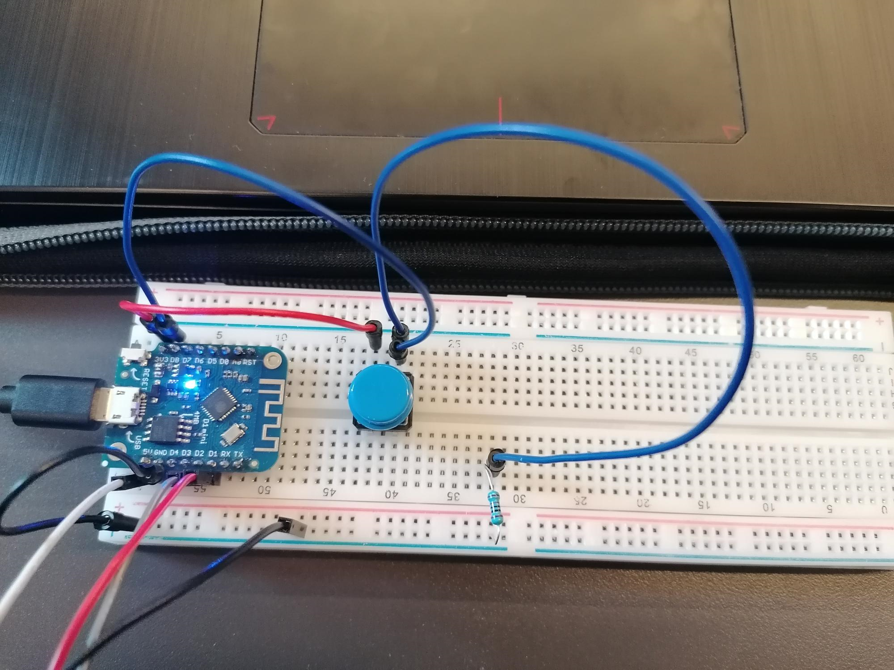

# Embedded device Technical Documentation

## Device description

My device is called the PokeDice, a dice which is I made for my ten-year-old brother

When thinking of a design I considered the following things, I wanted my device to be simple and easy to use for someone at his age.
In order to do this I made my device consist of an LCD screen where I would display the result of the roll and a button which would allow you to navigate through the device.

## Code description

Place relevant code snippets here and describe what the code does. No screenshots but code blocks such as:

Code snippet 1:
```c++
//Method is responsible for posting score to the database
void postRequest(int score){
  //Initialize variables
  WiFiClient client;
  HTTPClient httpClient;
  DynamicJsonDocument jsonBuffer(1024);
  
  Serial.print("HTTP POST begin \n");
  //Begin httppost request by specifying that we are sending json
  httpClient.begin(client, "http://9dd8-2a02-a44a-4963-1-7048-daa7-5462-aad5.ngrok.io/roll");
  httpClient.addHeader("Content-Type", "application/json");

  //Create a string to pass as jsondata in the postrequest
  String payload = "{\"score\":\"" + String(score) + "\",\"roll_date\":\"0\"}";

  int httpResponseCode = httpClient.POST(payload);

  if(httpResponseCode>0){
    String response = httpClient.getString();  //Get the response to the request
    Serial.println(httpResponseCode);   //Print return code
    Serial.println(response);           //Print request answer
  } else {
    Serial.print("Error on sending POST: ");
    Serial.println(httpResponseCode);
    httpClient.end();
  } 
}
```

Code snippet 2:
```c++
//Method is responsible for getting a roll from the hva api
void getRollNumber(){
  //Intialize variables
  WiFiClient client;
  HTTPClient httpClient;
  DynamicJsonDocument jsonBuffer(1024);

  Serial.print("HTTP begin \n");
  httpClient.begin(client, "http://api.iot.hva-robots.nl/dice/6");
  int httpResponseCode = httpClient.GET();

  //Check whether http request is good
  if(httpResponseCode == HTTP_CODE_OK) { // HTTP_CODE_OK == 200
    String payload = httpClient.getString();
    deserializeJson(jsonBuffer, payload);
    //create an int which we pass to postRequest method
    int dice = jsonBuffer["data"]["dice"];
    Serial.print("Rolled this number: ");
    Serial.println(dice);

    postRequest(dice);
  } else {
    //Return error message and stop HTTPclient from running
    Serial.print("Error on sending GET: ");
    Serial.println(httpResponseCode);
    httpClient.end();
  }
}
```

## Wiring diagram

Here are some photos of what my breadboard looked like when finishing all the wiring




Use [fritzing](https://fritzing.org/) or a schematic editor to create a readable wiring diagram.

Readable means:
- No diagonal wires
- Minimize wire crossovers
- Wire colors
  - Black for negative voltage
  - Red for positive voltage
  - Every signal a different color, or at least grouped by functionality
- Annotate parts, add text and values

Possible software:
- [KiCAD](https://www.kicad.org/)
- [EasyEDA](https://easyeda.com/)
- [Fritzing](https://fritzing.org/)
- [Eagle](https://www.autodesk.com/products/eagle/overview) as part of Fusion360


## Bill of Materials
