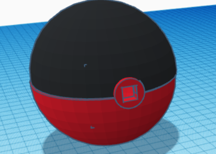
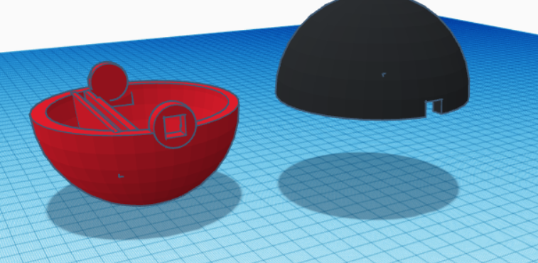
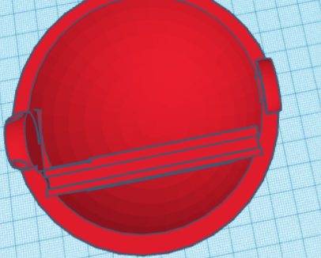
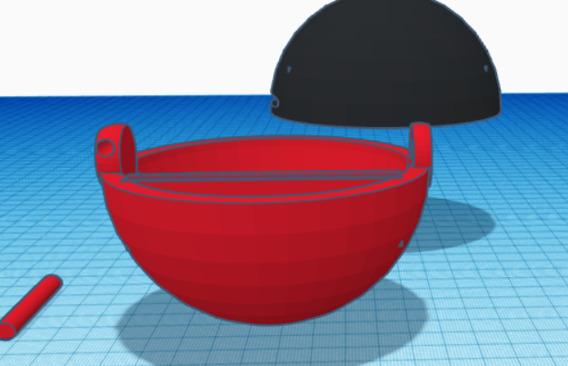

# Physical Design

## Design choices

This chapter is divided into 3 subsections:
- Product requirements
- Pictures of makeshift prototypes
- Photos of makeshift prototypes

### Product requirements:

- Device should look like an actual dice
- Device should clearly give an indication of battery level
- Device should show you what has been rolled
- Device should indicate when it's going to roll

[comment]: <> (- Pictures of sketches)

[comment]: <> (- Photos of makeshift prototypes)

[comment]: <> (- Design choices)

At first, I wanted my design to look like an actual dice, however
after some reconsidering I decided to base it something more out of the box since 
I couldn't do much with a cube alone, so based on that I decided to instead make my casing into
a circular shape this way it's easier to roll. Lastly I wanted my device to be iconic, therefore I decided to base my casing off a poke-ball

## Design

These concepts were all designed using TinkerCad

Rectangular shaped poke dice:

Circular poke dice:

Final design:

Top-down image of the inside of one of the disks:

Diagonal image of the pokedice

## Fabrication

I mainly cut shapes in order to create my casing, I also used a 3D printer to print out my casing for my device.

## Fabrication Process

I think one of the hardest parts of making my casing was thinking about how I would design my casing in a way that it would be able to be 3d printed by the 3d printer.

My 3d design was at first 20cm x 20cm x 20cm, however this size would have taken way to long for the 3d printer to print out. 
This would have been easier to realize with laser cutting, but it would have still been hard since I am working with circular shapes.

Another problem I encountered was how to close my casing, by closing I mean the mechanism to open and/or close the casing. 
In the end I found a simple solution, I made a cylinder shaped hole inside the poke dice where I'll be able to fid a cylinder shaped rod.
This way it's very easy to connect the two disks together.
