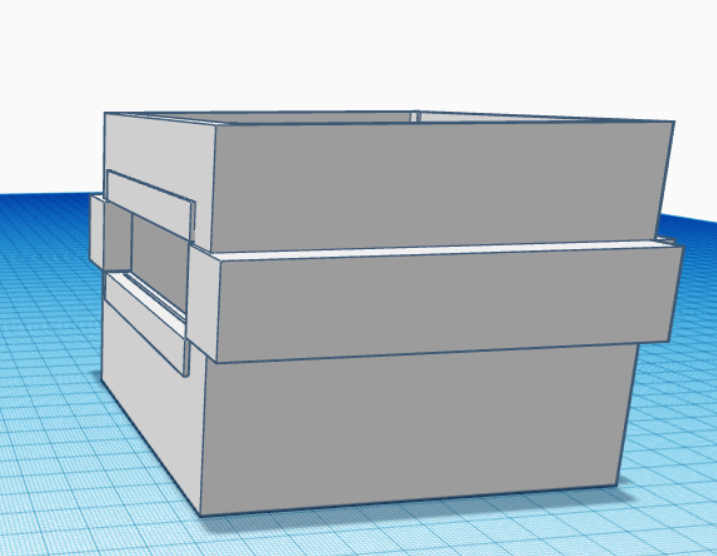

# Physical Design

## Design choices

This chapter is divided into 3 subsections:
- Product requirements
- Pictures of makeshift prototypes
- Photos of makeshift prototypes

### Product requirements:

- Device should look like an actual dice
- Device should clearly give an indication of battery level
- Device should show you what has been rolled
- Device should indicate when it's going to roll

[comment]: <> (- Pictures of sketches)

[comment]: <> (- Photos of makeshift prototypes)

[comment]: <> (- Design choices)

At first, I wanted my design to look like an actual dice, however
after some reconsidering I decided to base it something more out of the box since 
I couldn't do much with a cube alone, so based on that I decided to instead make my casing into
a circular shape this way it's easier to roll. Lastly I wanted my device to be iconic,

## Design

These concepts were all designed using TinkerCad

Rectangular shaped poke dice

Circular poke dice

## Fabrication

- detailed description of fabrication techniques used

I mostly used a 3D printer to print out my casing for my device

## Fabrication Process

Describe what went well and what went wrong

