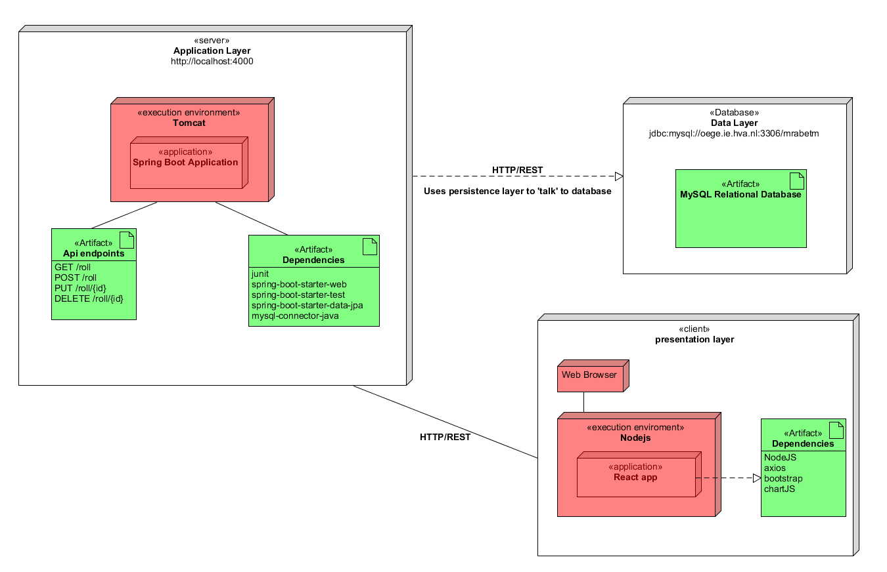
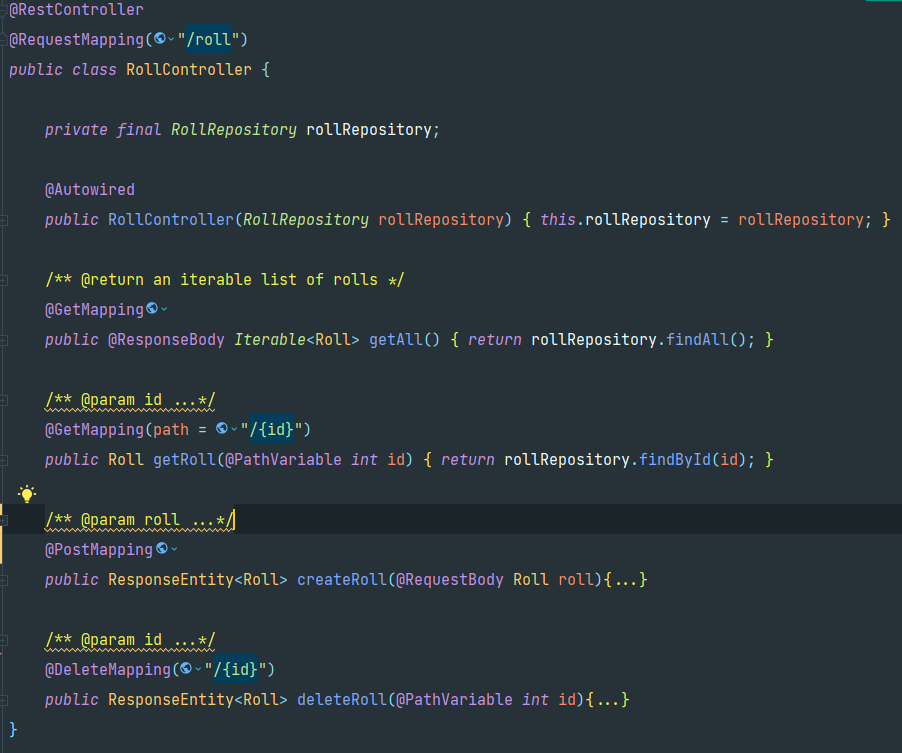

# Web Application


##Architecture diagram


## Description and screenshots

#### Front-end

##### GetAllRolls
```typescript jsx
/**
 * @Author Mortada M'Rabet
 * Method is used to fetch all rolls from the api/roll route
 * and puts them in an array
 */
getAllRolls = () =>{
    Api.get('/roll')
        .then(res => {
            this.setState({
                rolls: res.data
            })
        }).catch(console.error)
}
```
Simple get method used to fetch data from the api./roll route


#### Backend

##### Roll-repository


This repository is responsible for the multiple paths used to get or alter data which we fetch from the database
So if we wanted to get a list of rolls, we simply make a get request to the following url: localhost:8080/roll


## Back-end technology and database
Along with showcasing which technologies I used for the back-end, 
I will also explain why I used these methods/technologies:

Back-end = Spring boot

The reason why I choose spring boot, was mainly because I have some experience with this back-end framework.

Database = MySql database

The reason why I choose a mysql database instead of a non-relational database was purely for the reason
that we are basically saving small amounts of data. By data, I mean the amount of rolls made by the dice.

Also, the web application more secure, as we could also save information about the initial dice.
This is possible with a nosql database, however we can't relate a roll to this dice. This would mean that we don't know were this
roll came from, when we have multiple dices.

However, I did consider the fact that there are also benefits to using a non-relational database.
For example, when we want to save large amounts of data regarding the rolls which have been made by the dice it would be useful.

## Front-end technology
Front-end framework = React.js

## Libraries
- Chart.js
- React-bootstrap
- Axios
## 3rd party API
